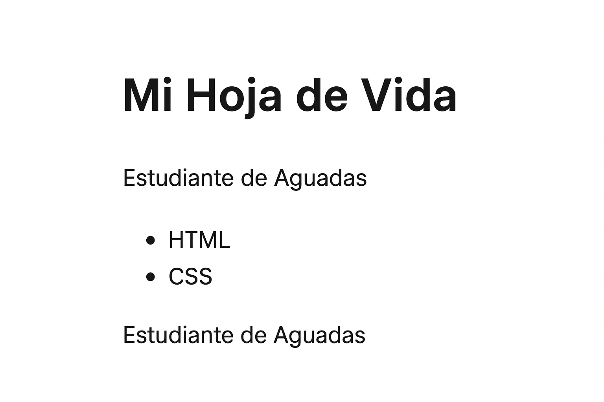
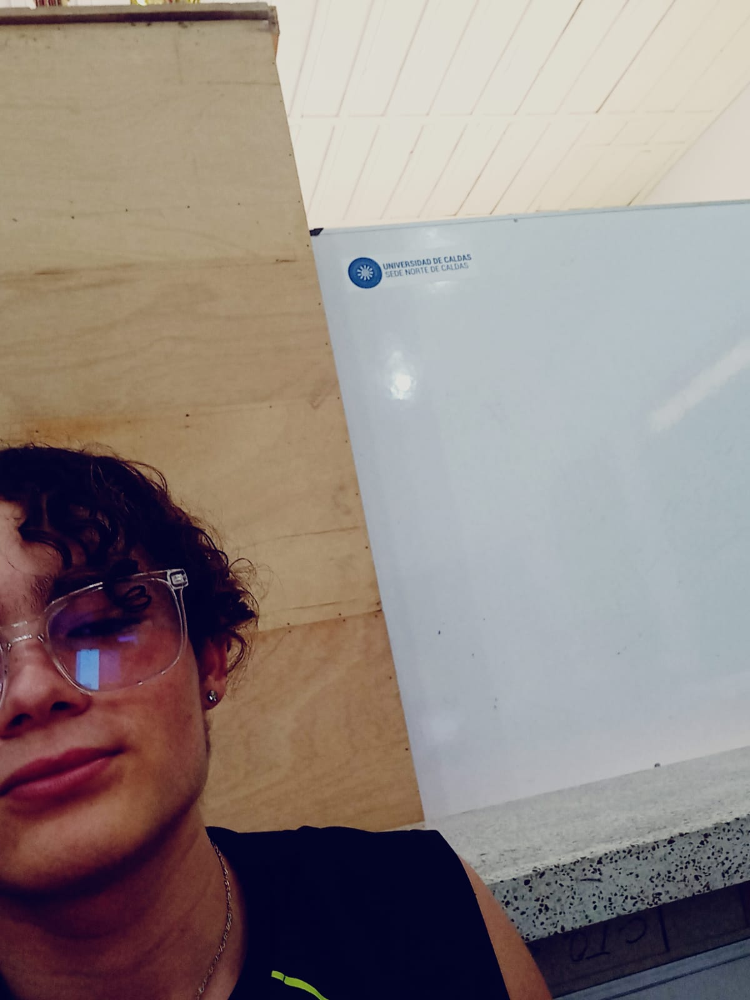
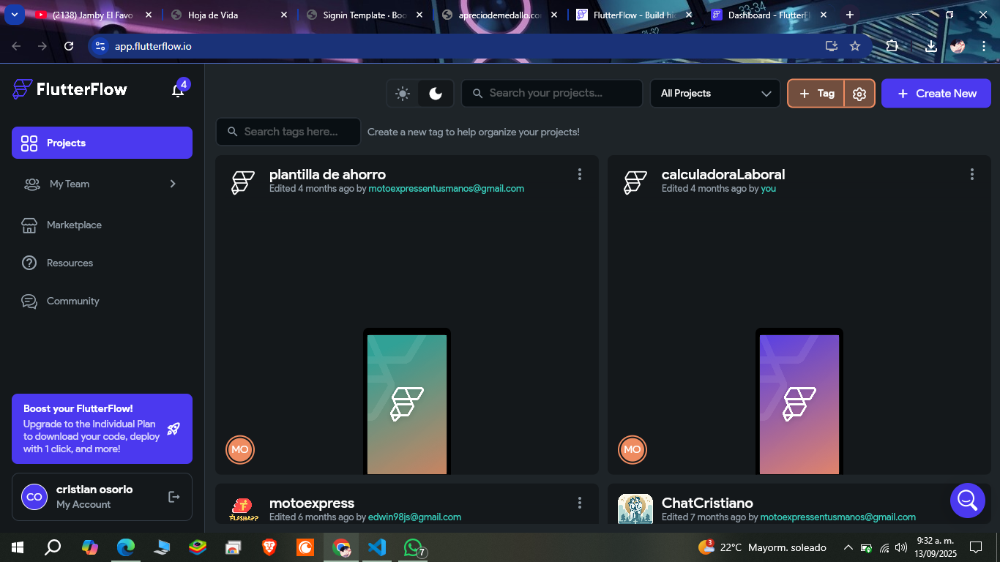
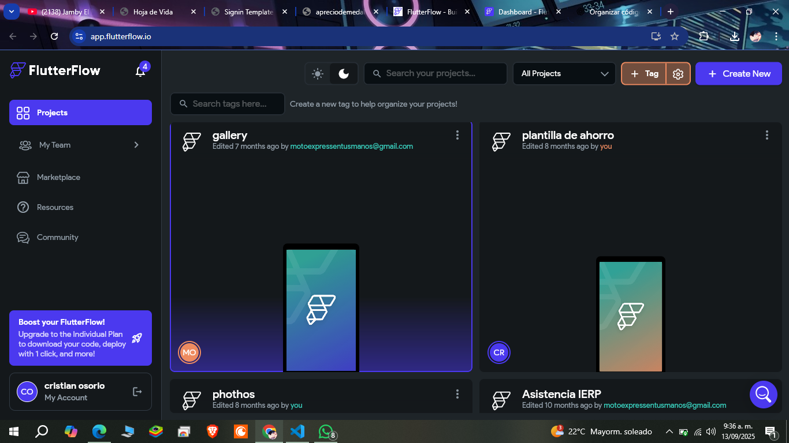
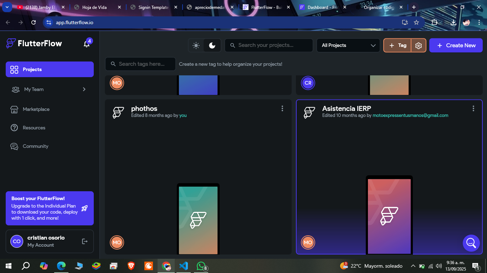

<!DOCTYPE html>
<html lang="es">
<head>
    <meta charset="UTF-8">
    <meta name="viewport" content="width=device-width, initial-scale=1.0">
    <title>Hoja de Vida</title>
    
</head>
<body>
    <main>
        <!-- Parte 1 -->
        <h1>Mi Hoja de Vida</h1>
        
        <ul>
            <li>HTML</li>
            <li>CSS</li>
        </ul>
        
        
Estudiante de Aguadas

        <h2>Vista previa en el navegador:</h2>
        

        <!-- Parte 3 -->
        <h2>Correcciones de Código</h2>

        

            
❌ &lt;h1&gt;Mi nombre&lt;h1&gt;

            
✅ Correcto: &lt;h1&gt;Mi nombre&lt;/h1&gt; 👉 El error era que no se cerró con &lt;/h1&gt;.

        

        

            
❌ &lt;p&gt;Este es un párrafo&lt;p&gt;

            
✅ Correcto: &lt;p&gt;Este es un párrafo&lt;/p&gt; 👉 El error era que no se cerró con &lt;/p&gt;.

        

        

            
❌ &lt;img src=imagen.jpg&gt;

            
✅ Correcto: &lt;img src="imagen.jpg" alt="Descripción de la imagen"&gt; 👉 Faltaban las comillas y el atributo alt.

        

        

            
❌ colr: blue;

            
✅ Correcto: color: blue; 👉 Estaba mal escrito colr, debe ser color.

        

        

            
❌ font sixe: 16px;

            
✅ Correcto: font-size: 16px; 👉 Error de escritura, debe ser font-size.

        

        <!-- Parte 4 -->
        <h2>Parte 4 – Quiz Creativo</h2>

        

            
1. ¿Cuál es la diferencia entre &lt;ul&gt; y &lt;ol&gt;?

            
👉 &lt;ul&gt; crea listas desordenadas con viñetas, mientras que &lt;ol&gt; crea listas ordenadas con números.

        

        

            
2. ¿Qué hace la propiedad border-radius en CSS?

            
👉 Redondea las esquinas de un elemento.

        

        

            
3. ¿Qué propiedad de CSS cambia el color de fondo?

            
👉 background-color.

        

        

            
4. ¿Cómo se escribe un comentario en HTML?

            
👉 &lt;!-- Esto es un comentario --&gt;.

        

        

            
5. ¿Cuál es la función de la etiqueta &lt;header&gt;?

            
👉 Define la cabecera de una página o sección.

        

        

            
6. ¿Qué propiedad CSS se usa para centrar un texto?

            
👉 text-align: center;

        

        

            
7. ¿Cuál es la diferencia entre id y class en CSS?

            
👉 id es único para un elemento, class puede aplicarse a varios elementos.

        

        

            
8. ¿Qué significa la etiqueta &lt;footer&gt;?

            
👉 Representa el pie de página de un documento o sección.

        

        

            
9. ¿Qué etiqueta se usa para insertar una imagen en HTML?

            
👉 &lt;img&gt;.

        

        

            
10. ¿Cuál es la etiqueta correcta para un párrafo?

            
👉 &lt;p&gt;.

        

        

            
11. ¿Cómo se crea una lista ordenada?

            
👉 Con la etiqueta &lt;ol&gt; y dentro &lt;li&gt; para cada ítem.

        

        

            
12. ¿Qué atributo se usa para enlazar una hoja de estilos CSS en HTML?

            
👉 rel="stylesheet" dentro de la etiqueta &lt;link&gt;.

        

        

            
13. ¿Qué propiedad de CSS se usa para cambiar el color del texto?

            
👉 color.

        

        

            
14. ¿Cómo se centra un texto en CSS?

            
👉 text-align: center;

        

        <!-- Parte 5 -->
        <h2>Parte 5 – Mi Página en Papel</h2>
        

            <header style="text-align: center;">
                <h1>Cristian Osorio</h1>
                
                
Desarrollador de aplicaciones con experiencia en FlutterFlow

            </header>

            <section>
                <h2>Mis Proyectos</h2>
                

                    

                        
                        <h3>Gallery</h3>
                    

                    

                        
                        <h3>Phothos</h3>
                    

                    

                        
                        <h3>Asistencia IERP</h3>
                    

                

            </section>

            <section class="servicios">
                <h2>Servicios</h2>
                

                    🚀 Desarrollo de aplicaciones móviles en FlutterFlow. 
                    💻 Creación de prototipos y diseños personalizados. 
                    📲 Asesorías para proyectos digitales. 
                    📦 Entregas rápidas y funcionales.
                

            </section>
        

    </main>

    <!-- Parte 2: Siempre al final -->
    <footer>
        
Hago constar que la información aquí consignada es verídica y puede ser comprobada por cualquier persona.

        
Derechos de Autor <strong>Cristian Osorio Lopez</strong>.

    </footer>
</body>
</html>

